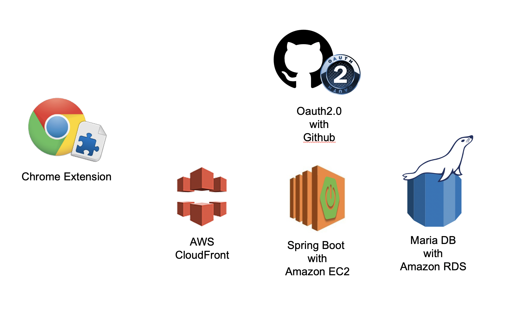

# 식전 수프처럼 페어와의 협업 맛을 돋우는 에피타이저, *SUPP*

## 💎 기획 의도, 우리의 가치

페어가 바뀔 때마다, 팀이 바뀔 때마다 설레는 마음과 동시에 *"페어랑 잘 맞았으면 좋겠는데, 어떤 이야기를 꺼내야 하지? 어디서부터 어디까지 정해야 할까?"* 라는 걱정해 보신 적 있나요?

혹은, 매번 다른 페어에게 건네야 했던 *자신에 대한 반복적인 소개* 에 지치진 않으셨나요?

SUPP은 이런 걱정거리와 번거로움을 없애주어, 우리가 조금 더 편하고 즐겁게 협업을 진행할 수 있게 해준답니다! 그럼 이제 SUPP과 함께 할 준비가 되셨나요?

## 🎁 그래서 SUPP이 뭐라구요?

1. SUPP의 개발자 유형 검사를 통해 **자신의 개발 성향**을 알 수 있어요.
2. **페어 프로그래밍이나 팀 프로젝트 시, 자주 언급되는 몇 가지 규칙에 대하여 손쉽게 작성하고, 편하게 볼 수 있어요.** *"협업 시 코즈 사용 설명서 📜"* 와 같이 말이죠.

### 이름은 왜 SUPP이에요?

1. **🤜🤛 What's up?**

   처음 만난 페어(팀원)와 반갑게 인사를 해보세요! 와SUPP으로요!

2. **👭👬 SUpport Pair Programming**

   페어 프로그래밍에 도움을 주는 서비스! SUPP의 가장 큰 목표에요.💪

3. **🥣 soup**

   사실 supp은 에스토니아어로 [수프(soup)](https://ko.wiktionary.org/wiki/supp)라는 뜻이에요. 음식의 맛을 돋우기 위해 식전에 먹는 수프처럼, SUPP도 협업의 맛을 돋우기 위해 협업 전 서로를 알아볼 수 있게 하는 서비스인 거죠.

## ⚒ 어떻게 사용하는데요?

SUPP의 사용법은 아주 쉬워요! 딱, 3가지만 기억하세요.

**`로그인 - 정보 입력 - 정보 확인`**

우선,

1. SUPP에 접속하세요.
2. Github 계정으로 로그인을 하세요.
3. 질문에 답해주세요.

**그럼 정보 확인은 어디서 해요?**

1. 크롬 확장프로그램을 설치하세요.
2. 우아한테크코스에 접속하세요.
3. 나의 팀을 눌러 페어(팀원)에 대한 정보를 확인하세요.

## 🏗 어떻게 만들었어요?

SUPP은 또링, 스티치, 알트, 코즈, 토니 5명의 노력 99%와 1%의 할돈 수프가 탄생시킨 서비스예요😜

## 👻 긴 글 읽어주셔서 감사합니다. 사실은요..

2020년 6월 17일, 오늘 출시한 Supp은....! Beta 버전이에요😝 *'조금 더 완벽히 보완해서 바로 정식 서비스로 출시를 할까?'* 많이 고민했는데, 아무래도 **저희의 힘만으로는 수많은 버그를 찾기도, 완성도를 높이기도 힘들다고 판단**했어요. 그래서 여러분의 도움을 얻기 위해 조금 일찍 Beta버전을 열었답니다. 이 서비스를 사용하면서 **발생한 오류나, 보완하면 좋을 점들을 저희에게 알려주신다면, 열심히 고민하고 반영하면서 더 완성도 있는 서비스를 만들어 볼게요!** (가장 많은 이슈를 보내주신 분께는 *또링과의 식사쿠폰* 이 나갈지도..? 아, 물론 다른 크루와의 식사쿠폰으로 교체 가능합니다...😓)여기까지 읽어주셔서 정말 감사하고, 다들 앞으로 남은 미션, 프로젝트들도 SUPP과 함께 힘내서 해봐요! *우아한 테크 코스 화이팅 💙💜*

------

### 📎 이런 곳을 참고했어요!

- 개발자 타입 설문 : https://www.skyrise.tech/blog/tech/what-type-of-programmer-are-you/
- 16 personalties https://www.16personalities.com/